# 1. A Simple Argo CD Example

Argo CD is a declarative continuous delivery tool for Kubernetes. It delivers version controlled resources such as application definitions, configurations and target states from a Git repository.

You may want to fork this repository so that you can change its content to see how Argo CD updates the target states based on the modified content. If you do, remember to replace the URL of the Github repository I used in the following example with that of your forked repository.

## 1.1 [Ten Advantages Of Using Argo CD With Kubernetes](https://successive.cloud/10-advantages-argocd-with-kubernetes/)
The linked article explained the advantages of using Argo CD nicely. I've summarised them below for your convenience:
1. Single Source Of Truth
2. User Interface
3. Faster Update Directly In Cluster
4. Easy Roll Back
5. Cluster Disaster Recovery
6. Security
7. Scalability
8. Multi-Tenancy
9. Leverages Existing Tools
10. Monitoring and Alerting

## 1.2 A simple Real-World Example
Red Hat OpenShift is a hybrid cloud, enterprise Kubernetes platform with comprehensive features and developer-friendly functionality. This is a simple Argo CD example using helm and Kustomize on OpenShift, with emphasis on OpenShift features not found in Kubernetes eg, routes, OpenShift Templates which are used to provision the 140+ (CI/CD, databases, languages, middleware, etc.) services in the Developer Catalog of the OpenShift Console. The screen shown below can be accessed by selecting: Developer->+Add->All Services (Developer Catalog):

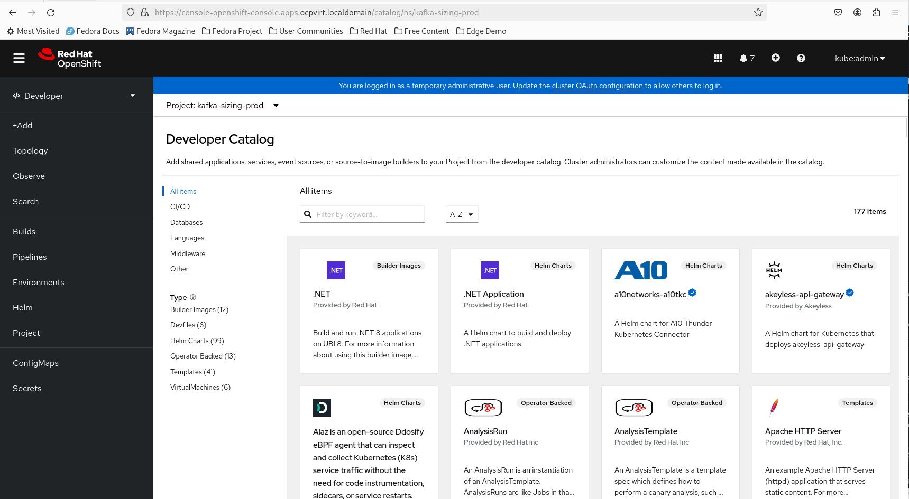

This project was inspired by the excellent Youtube video: [ArgoCD Starter Guide: Full Tutorial for ArgoCD in Kubernetes.](https://www.youtube.com/watch?v=JLrR9RV9AFA)

## 1.3 OpenShift Templates

According to the [OpenShift Container Platform v4.16 documentation:](https://docs.openshift.com/container-platform/4.16/openshift_images/using-templates.html)

> A template describes a set of objects that can be parameterized and processed to produce a list of objects for creation by OpenShift Container Platform. A template can be processed to create anything you have permission to create within a project, for example services, build configurations, and deployment configurations. A template can also define a set of labels to apply to every object defined in the template.

OpenShift templates use DeploymentConfig which predates the Kubernetes Deployment object, for deployment. DeploymentConfig has features not found in Deployment eg, lifecycle hooks for executing custom behaviour in different points during the lifecycle of a deployment. I shall be using this feature to create a MySQL database and initialise it with a database schema during deployment in my example. Although DeploymentConfig has been deprecated in OpenShift 4.14, it is still supported. Since all OpenShift Developer Catalog services use OpenShift Templates which, in turn, use DeploymentConfig, expect DeploymentConfig to be supported for a longer while yet.

Openshift template commands:
<pre>
# List all OpenShift templates
oc get templates -n openshift

# There are 147 OpenShift templates or
# Developer Catalog services
oc get templates -n openshift | wc -l
147

# Looking for the mysql-persistent template
oc get templates -n openshift | grep -i  mysql-persistent

# Describe the input parameters of the template
oc process --parameters mysql-persistent -n openshift
NAME                    DESCRIPTION                                                             GENERATOR           VALUE
MEMORY_LIMIT            Maximum amount of memory the container can use.                                             512Mi
NAMESPACE               The OpenShift Namespace where the ImageStream resides.                                      openshift
DATABASE_SERVICE_NAME   The name of the OpenShift Service exposed for the database.                                 mysql
MYSQL_USER              Username for MySQL user that will be used for accessing the database.   expression          user[A-Z0-9]{3}
MYSQL_PASSWORD          Password for the MySQL connection user.                                 expression          [a-zA-Z0-9]{16}
MYSQL_ROOT_PASSWORD     Password for the MySQL root user.                                       expression          [a-zA-Z0-9]{16}
MYSQL_DATABASE          Name of the MySQL database accessed.                                                        sampledb
VOLUME_CAPACITY         Volume space available for data, e.g. 512Mi, 2Gi.                                           1Gi
MYSQL_VERSION           Version of MySQL image to be used (8.0-el7, 8.0-el8, or latest).                            8.0-el8

# Process the template using the parameters defined in mysql.env and save the output to a file
oc process mysql-persistent --param-file=mysql.env -n openshift -o yaml > helm-kafka-sizing/templates/mysql.yaml

</pre>
The output of the last 'oc process' command is saved in helm-kafka-sizing/templates/mysql.yaml. The output yaml contains the following objects:
* a secret
* a service
* a PersistentVolumeClaim
* a DeploymentConfig
  
The content of my mysql.env:
<pre>
MEMORY_LIMIT=512Mi
NAMESPACE=openshift
DATABASE_SERVICE_NAME=mysql
MYSQL_USER=sa
MYSQL_PASSWORD=sa
MYSQL_ROOT_PASSWORD=sa
MYSQL_DATABASE=springSession
VOLUME_CAPACITY=512Mi
MYSQL_VERSION=8.0-el8
</pre>
The MySQL-related content of mysql.env has to match that in the application.properties file of the kafka-sizing application, which is shown below:
<pre>
spring.application.name=kafka-sizing

spring.profiles.active=@activatedProfile@

# define logging level
logging.level.com.appsdeveloperblog.examples=INFO

# application default parameters
# ------------------------------
# safetyFactor covers protocol overheads, data imbalance and sudden peaks
app.default.safetyFactor=1.6

# vCPUs per Kafka broker
app.default.vcpusPerBroker=8
app.default.vcpuIncrement=2

# memory in GB per Kafka broker
app.default.memPerBroker=32

# vCPUs per Zookeeper node
app.default.vcpusPerZkNode=4

# memory in GB per Zookeeper node
app.default.memPerZkNode=16

# disk required in GB per Zookeeper node
app.default.diskPerZkNode=100
# ------------------------------

# Database configuration
spring.datasource.url=jdbc:mysql://mysql:3306/springSession
spring.datasource.username=root
spring.datasource.password=sa
spring.datasource.driver-class-name=com.mysql.cj.jdbc.Driver
spring.datasource.platform=mysql
spring.datasource.initialization-mode=never
#spring.session.jdbc.initialize-schema=always
spring.session.store-type=jdbc 
spring.session.jdbc.table-name=SPRING_SESSION

server.servlet.session.timeout=30m

</pre>

## 1.4 Routes
A route exposes a service at a public URL. It can either be secure (HTTPS) or unsecured (HTTP), depending on the network security configuration of your application. The cloest equivalence in Kubernetes is an Ingress object. 
  
When a Route object is created on OpenShift, it gets picked up by the built-in HAProxy load balancer in order to expose the requested service and make it externally available with the given configuration.

# 2. Prerequisites
You must have the following before you can deploy the example using Argo CD:
* An OpenShift Cluster
* An OpenShift account with cluster-admin rights
* The Red Hat OpenShift GitOps Operator installed
* You have installed the helm, kustomize and oc command binaries
* An Argo CD instance has been created for each namespace you want to deploy the example application in eg, kafka-sizing-dev and kafka-sizing-prod in this example. A shell script has been provided to help you do this. See Section 4 for more details.

# 3. Deploying My Example Application
My example application is a Java application called kafka-sizing. Its source code can be found in my [Github repo](https://github.com/AndyYuen/kafka-sizing). It is just for reference. You don't have to compile it or understand how it works. Its container image can be found at:
<pre>
quay.io/andyyuen/kafka-sizing-mysql:latest
</pre>
The application requires a MySQL database to persists user sessions and parameters entered for sizing purposes. FYI, here is the problem statement for the application:

> Enterprises planning to use Red Hat AMQ Streams (Kafka) want to get an idea as to how many subscription cores they need to purchase. The intention of this tool is to provide an educated estimate. Nothing beats simulating the load on your hardware but this is not always feasible. The next best thing is to develop an analytical model to do the estimation.

You do not have to understand how it arrives at the estimation. I am using this as an example because it is a non-trivial application requiring a MySQL database which can be deployed using an OpenShift Template from the Developer Catalog.

## 3.1 Deploymant Using a Helm Chart
Helm is a package manager that provides easy automated deployment and management  of applications for Kubernetes. Helm uses charts which contain a collection of yaml files with template directives that define the application's components, their dependencies and configurations. It dynamically renders these yaml files with template directives to generate Kubernetes manifests based on values provided by the user in valuesXXX.yaml files.

### 3.1.1 My Example Helm Chart Organisation
The Helm chart directory structure is shown below:
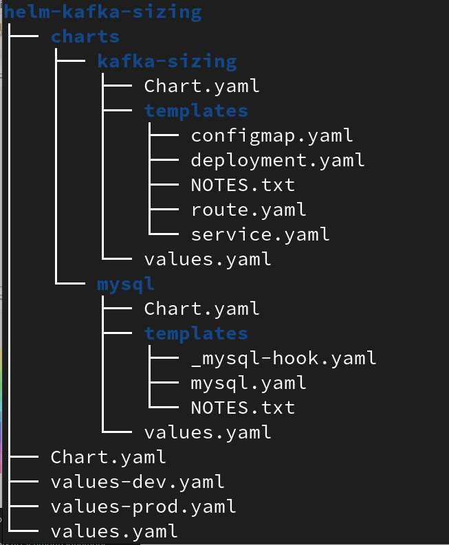

I have a parent chart (helm-kafka-sizing) which consists of two child charts (kafka-sizing and mysql). Each chart has its own values.yaml file. The parent Chart.yaml defines the dependencies on the two child charts:
<pre>
...
dependencies:
  - name: kafka-sizing
    version: "0.3.0"
    repository: "file://./charts/kafka-sizing"
    enabled: true
  - name: mysql
    version: "0.1.0"
    repository: "file://./charts/mysql"
    enabled: true

</pre>

### 3.1.2 Templates and Values
The yaml files in the templates directories have been set up with template directives and the syntax is shown below:
<pre>
apiVersion: apps/v1
kind: Deployment
metadata:
  name: {{ .Values.appName }}
  labels:
    app: {{ .Values.appName }}
spec:
  replicas: {{ .Values.replicas }}
  ...
</pre>
Each parameter specified in the template directive is replaced by those defined in the values.yaml and/or values-XXX files when you install the Helm chart.
Here is the values.yaml for kafka-sizing:
<pre>
appName: kafka-sizing

port: 8080

replicas: 1

schemaUrl: https://raw.githubusercontent.com/andyyuen/kafka-sizing/master/src/main/resources/schema-mysql.sql

configmap:
  name: kafka-sizing

databaseRootPassword: sa

image:
  name: quay.io/andyyuen/kafka-sizing-mysql
  tag: latest

requests:
  memory: 200Mi
  cpu: 100m

limits:
  memory: 500Mi
  cpu: 400m

</pre>
The mysql.yaml file in the mysql chart was generated using an OpenShift Template. The template directives were inserted afterwards.
To add the DeploymentConfig lifecycle hook to the mysql.yaml, a named template, _mysql-hook.yaml, is used. Its content is shown below:
<pre>
{{ define "mysqlHook" }}
recreateParams:
  post:
    execNewPod:
      command:
        - /bin/sh
        - '-c'
        - >-
          curl -o ~/schema-mysql.sql 
          {{ .Values.schemaUrl }}
          && /usr/bin/mysql -h mysql --protocol TCP -u
          $MYSQL_USER -D $MYSQL_DATABASE -p$MYSQL_PASSWORD <
          ~/schema-mysql.sql
      containerName: mysql
    failurePolicy: abort
{{ end }}
</pre>
The template's name is 'mysqlHook'. Notice that it, in turn, uses a template directive to allow substitution of the parameter 'schemaUrl' pointing to a database schema file.
The named template is invoked in the mysql.yaml file:
<pre>
  ...
  spec:
    replicas: 1
    selector:
      name: mysql
    strategy:
      type: Recreate
      {{- include "mysqlHook" . | indent 6 }}
    template:
      metadata:
        labels:
          name: mysql
	...	  
</pre>
Pay attention to the 'indent 6' function call which specifies that the yaml code block needs to be preceded by 6 spaces.

Note: The mysql DeploymentConfig's imageChange trigger changes the image name (initially left blank) causing Argo CD to constantly get out of sync. Although Argo CD allows ignoring differences at a specific JSON path, using RFC6902 JSON patches and JQ path expressions, I want to keep it simple. I just commented out the imageChange trigger and filled in the image name to get rid of the out-of-sync error.

Helm does not have a convenient mechanism to generate a configmap object like kustomize's configMapGenerator. Hence, I am making use of this kustomize feature to generate a configmap based on kafka-sizing's application.properties file for my Helm chart. See Section 4 for details.
Note that the dev and prod environments have different MySQL passwords with matching kafka-sizing configmap and mysql secret.

### 3.1.3 Deploying My Helm Chart Without Argo CD
All you need to do is switch to the project (namespace) you want to deploy in and run the helm command:
<pre>
# Switch to an existing project eg, helm-test
oc project helm-test

# Install the application from the 'simple-argo-example/helm-kafka-sizing' directory,
# using the dev environment configuration
helm install helm-kafka-sizing . --values values-dev.yaml

# Uninstall the application
helm uninstall helm-kafka-sizing
</pre>

### 3.1.4 Deploying My Helm Chart With Argo CD
You need to log in to the Argo CD UI. The UI can be invoked as follows:

From the OpenShift Console's Administrator->Networking->Routes tab, select project 'openshift-gitops' and click on the Location's arrow-in-a-box symbol of 'openshift-gitops-server':
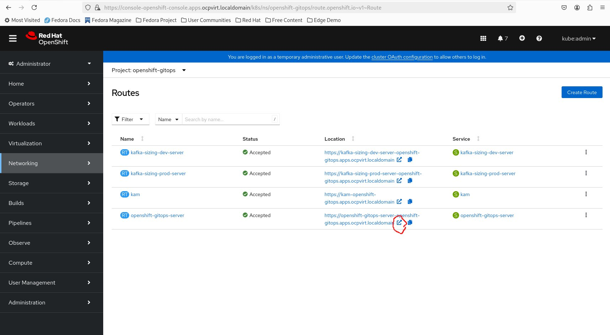

And the Argo CD UI will come up:
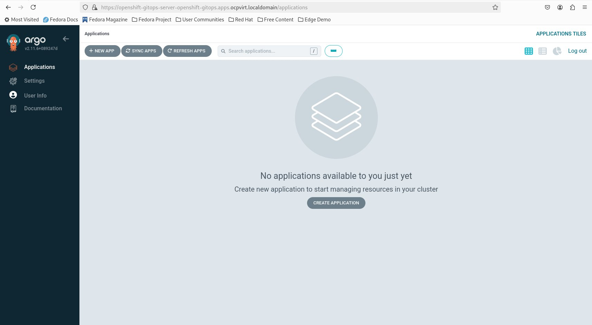

Note that you may encounter a login page first.
Click '+ NEW APP' and enter the parameters as shown:
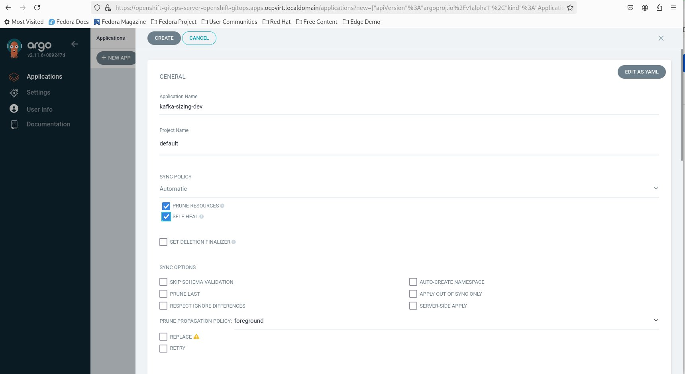
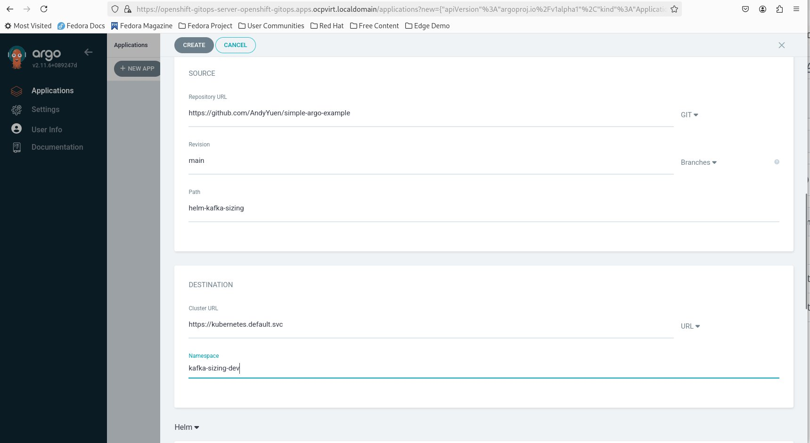
For the Helm section, you only need to select the values-dev.yaml files. The other parameters are filled in automatically.
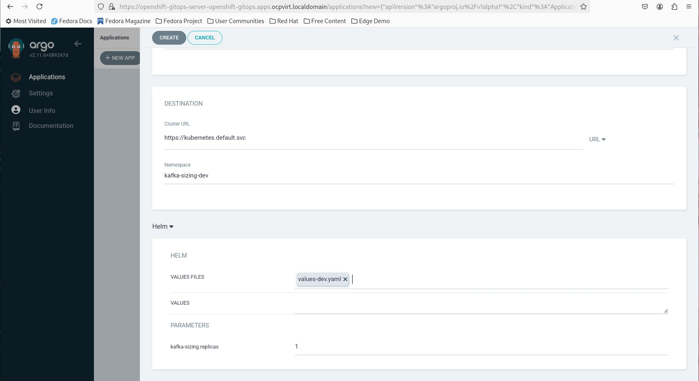
And you will see the application you just created:
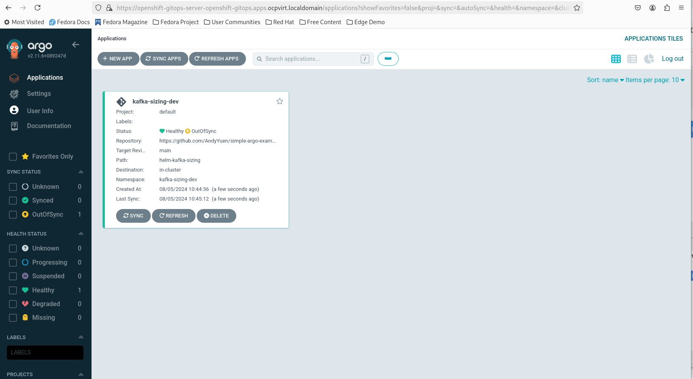
Click the application to see the applicatin details.
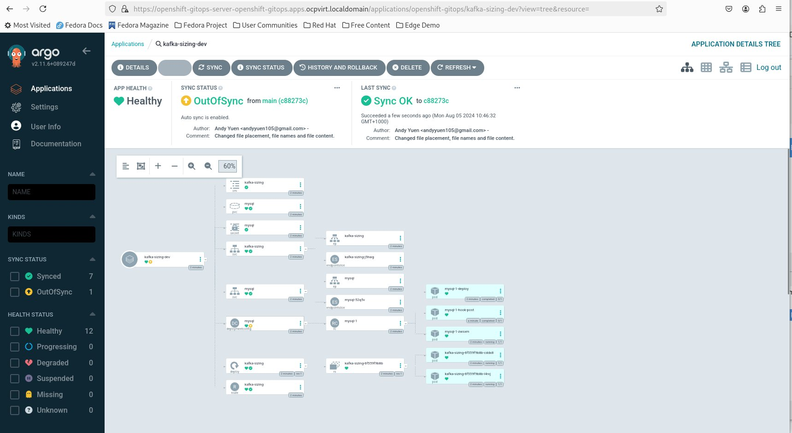
Notice that all the pods have a green heart, meaning everything is OK. The application has been set with specific requests/limits for cpu and memory values using the values.yaml. The number of replicas was updated with the values in the values-dev.yaml.
You can access the deployed kafka-sizing application by using its route. Select Administrator->Networking->Routes, pick the 'kafka-sizing-dev' project and then click on the arrow-in-a-box icon:
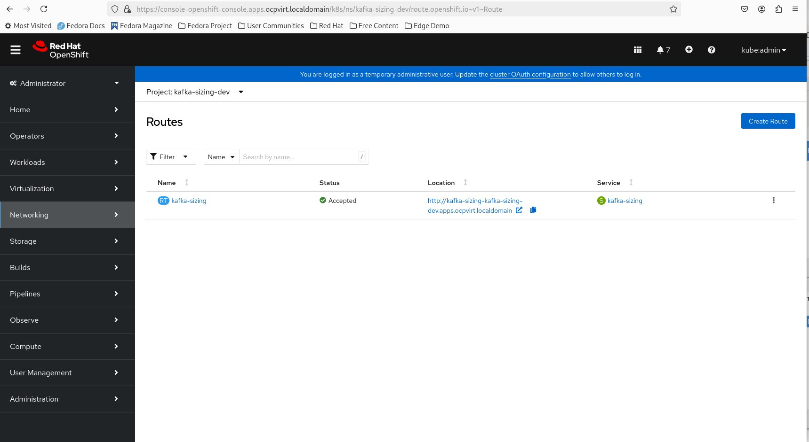
And you will see the kafka-sizing UI. You may play around with it and see what resources are required to run a particular Kafka workload.
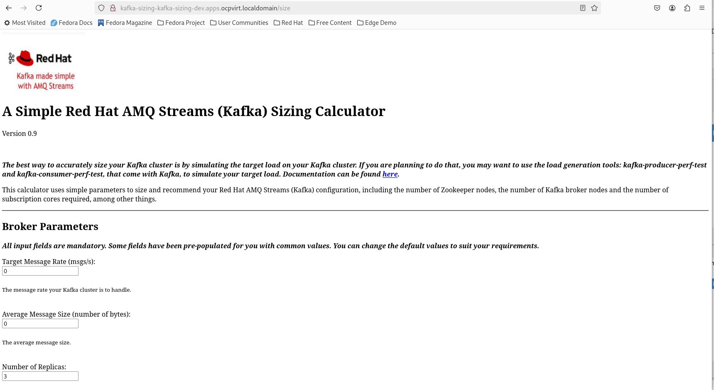

### 3.1.5 The Main Difference Between Deployment Using Helm and Argo CD
Argo CD is a declarative continuous delivery tool for Kubernetes. It is implemented as a Kubernetes controller meaning that it continuously monitors running applications and compares the current state with the target state. An application with the current state deviating from the target state is considered out-of-sync. Argo CD allows you to manually or automatically synchronise applications to their target states. In my example, I am using auto-sync.
To see it work, you can change the values-dev.yaml file:
<pre>
# from:
replicas: 2

# to:

replicas: 4
</pre>
and push the change to your Git repository. Argo CD, once detected the change, will provison 3 additional kafka-sizing pods to make the current state match the target state. Note that Argo CD does not detect the change instantly. Be patient.

Neither Helm nor Kustomize can do this by themselves.

## 3.2 Deployment Using Kustomize
In this section, I am doing the deployment using Kustomize.
  
Kustomize is a declarative configuration management/transformation tool included natively in the oc or kubectl command. In our case, you need to have the kustomize command binary installed on your machine to execute the processConfigmap.sh shell script (see Section 4.).
Kustomize lets you transform template-free (ie, without using template directives in the Helm chart shown earlier) yaml files without modifying the original yaml files. And it has convenience features such as configMapGenerator and secretGenerator that are not found in Helm.
Kustomize works by overlaying base Kubernetes manifests with user-defined customisation defined in kustomization.yaml files.
  
The same kafka-sizing application will be used to contrast the different approaches used by Helm and Kustomize.

### 3.2.1 My Kustomize Example Organisation
The kustomize directory structure is shown below:
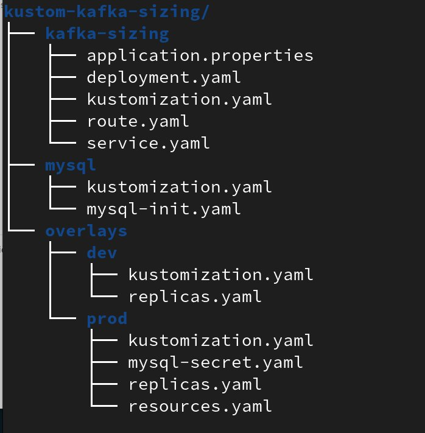

Kafka-sizing and mysql are the directories containing the base manifests. The dev and prod directories contain overlays which are applied on top of the base manifests allowing for configuration changes without modifying the base manifests for the 'dev' and 'prod' environment respectively.

Here is the kustomization.yaml file in the prod directory for transforming the base manifests:
<pre>
apiVersion: kustomize.config.k8s.io/v1beta1
kind: Kustomization
resources:
- ../../kafka-sizing
- ../../mysql

patches:
- path: resources.yaml
- path: replicas.yaml
- path: mysql-secret.yaml

configMapGenerator:
- name: kafka-sizing
  behavior: merge
  literals:
  - spring.datasource.password=ssp
</pre>
resources: points to the two base directories kafka-sizing and mysql.
patches: instructs kustomize to merge the resources.yaml and replicas.yaml with the appropriate base manifests. In this case, they both transform the kafka-sizing deployment manifest. resources.yaml transforms the resource requests/limits on cpu and mamory and replicas.yaml transforms the number of replicas. 
Both resources.yaml and replicas.yaml contains selectors to identify the the base manifest, in this case, deployment. Let's look at the resources.yaml.
<pre>
apiVersion: apps/v1
kind: Deployment
metadata:
  name: kafka-sizing
spec:
  template:
    spec: # Pod spec
      containers:
      - name: webcontainer
        resources:
          requests:
            memory: "400Mi" 
            cpu: "200m"
          limits:
            memory: "800Mi"
            cpu: "500m"

</pre>
The selectors: Kind, metadata/name and spec/template/spec/containers/name, allow Kustomize to identify the resources we want to change.
  
The kustomization.yaml file in the dev directory is shown below:
<pre>
apiVersion: kustomize.config.k8s.io/v1beta1
kind: Kustomization
resources:
- ../../kafka-sizing
- ../../mysql

patches:
- path: replicas.yaml

</pre>
Its is similar to the one in the prod directory but only transforms the number of replicas in the base manifest. The resource requests/limits on cpu and memory remain unchanged from the base mainfest, unlike the one in the prod directory.
mysql-secret.yaml transforms the mysql secret's passwords.
And the configMapGenerator section changs the mysql password in the kafka-sizing configmap.

### 3.2.2 Deploying Using Kustomize without Argo CD
All you need to do is switch to the project you want to deploy in and run the kustomize command:
<pre>
# Switch to an existing project eg, kustomize-test
oc project kustomize-test

# Install the application from the 'simple-argo-example' directory 
# using the prod environment configuration
kustomize build kustom-kafka-sizing/overlays/prod | oc apply -f -
# or,
oc kustomize kustom-kafka-sizing/overlays/prod | oc apply -f -

# Uninstall the application from the simple-argo-example directory 
# using the dev environment configuration
kustomize build kustom-kafka-sizing/overlays/prod | oc delete -f -
# or,
oc kustomize kustom-kafka-sizing/overlays/prod | oc delete -f -
</pre>

### 3.2.3 Deploying Using Kustomize With Argo CD
The same procedure (used in 3.1.4 Deploying the Helm Chart With Argo CD) is used for deployment using Kustomize with Argo CD.
Click + NEW APP and enter the parameters as shown:
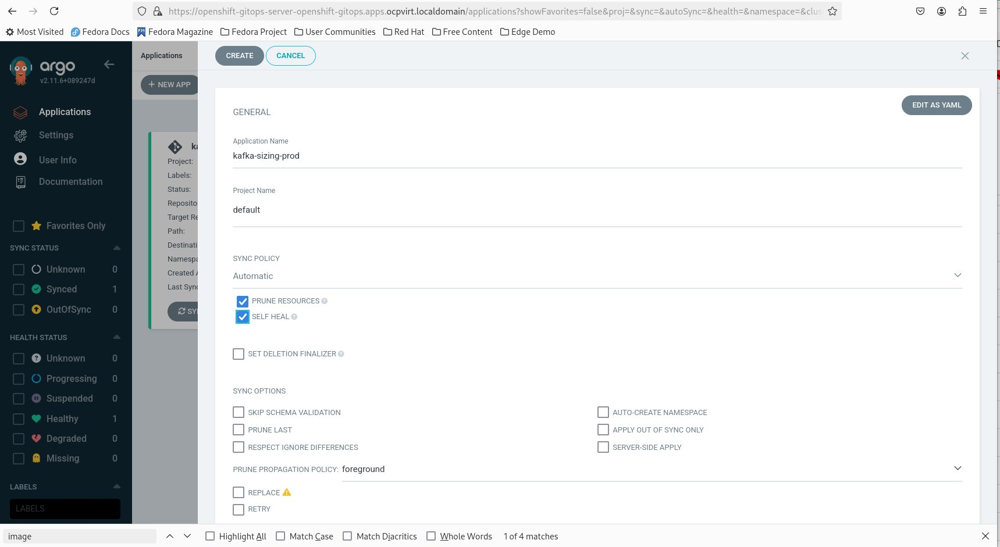
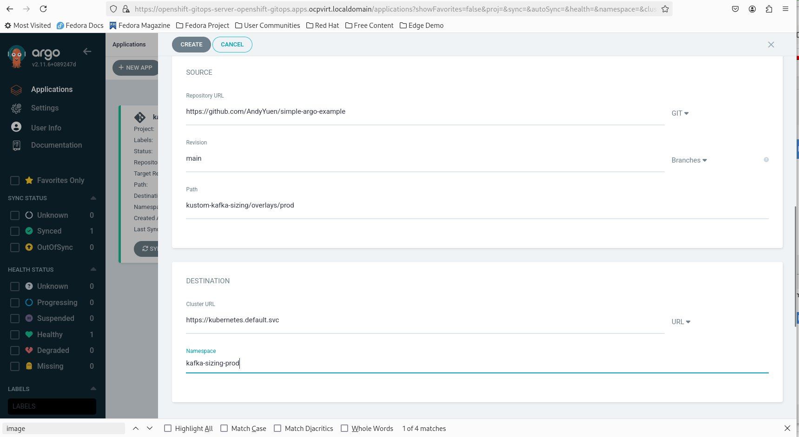
For the Kustomize section, you do not need to enter anything. The required parameters are filled in automatically to run my example application.
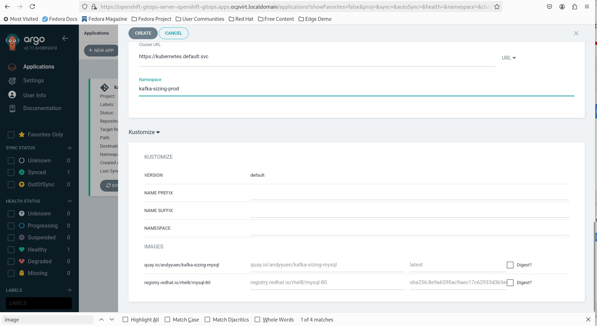
And you will see the application you just created:
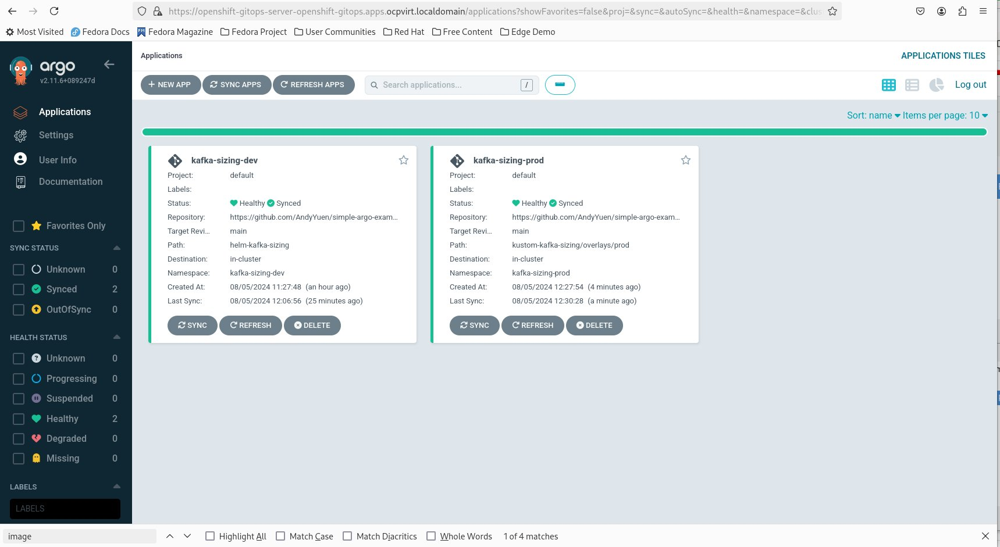
Click on the application to see the applicatin details.
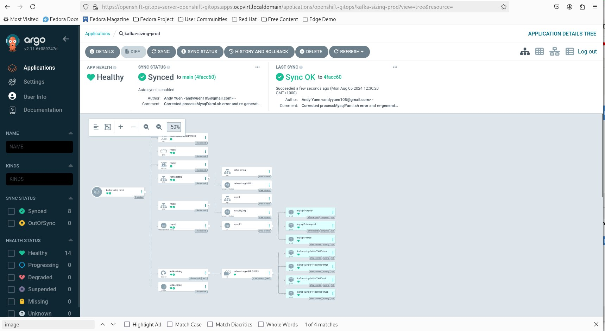
Notice that all the pods have a green heart, meaning everything is OK. There are 4 replicas of the kafka-sizing application with specific requests/limits for cpu and memory values that are different from the dev environment.

# 4. Utility Shell Scripts
Three utility shell scripts have been provided for your convenience.

1. createArgoCDInstance.sh - this script creates an Argo CD instance in the namespace you specify. You must create an Argo CD instance in each namespace you want to deploy my example application in. It is assumed that you execute these shell scripts from the scripts directory.
<pre>
# Usage: ./createArgoCDInstance.sh namespace
./createArgoCDInstance.sh kafka-sizing-prod
</pre>

2. addDeploymentConfigHook.sh - uses the child mysql chart to add a DeploymentConfig lifecycle post hook to mysql.yaml for database schema creation. This shell script does not require any input parameter. It is intended that you redirect the output to a file, mysql-init.yaml, in kustom-kafka-sizing's mysql directory.
<pre>
./addDeploymentConfigHook.sh > ../kustom-kafka-sizing/mysql/mysql-init.yaml
</pre>

3. createConfigmap.sh - creates and executes a temporary kustomize project to generate a configmap based on a properties file. This feature is missing in Helm. It is intended that you redirect the output to a file. The configmap.yaml in helm-kafka-sizing/charts/kafka-sizing's templates dirctory was generated using this shell script.
<pre>
./createConfigmap.sh > ../helm-kafka-sizing/charts/kafka-sizing/templates/configmap.yaml
</pre>

# 5. Conclusion
I've shown you how to deploy my example application using a Helm chart with Argo CD, as well as, using kustomize with Argo CD. Each approach has its pros and cons. For example, Helm's named template adds a lifecycle hook to the MySQL DeploymentConfig to initialise the database with a schema. And for Kustomize, it has a configMapGenerator that conveniently generates a config map from a properties file. Which tool to use depends on the use case and your preference.   
There are ways to use both Helm and Kustomize together with Argo CD eg, one way is to use a configmap containing a shell script and a side-car container. If you are interested in this approach, just google it. Or wait for my next Youtube video.

## ENJOY ;-) !!! 
